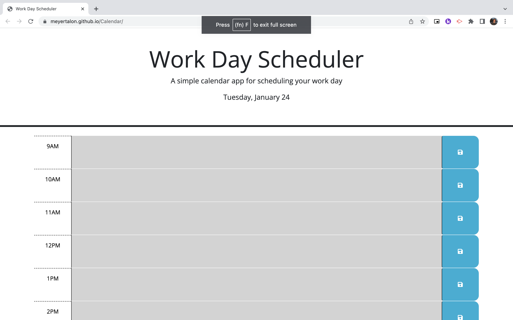

# Calendar

## Description
This webpage serves as a 9AM-5PM workday planner that saves the user's entered information
using local storage. The page also displays the current date and color codes the event boxes
based on the current time of day. For the most part this was created as an excerice to practice using Web APIs.

## Screenshot

Note that this screenshot was taken after the completion of the workday, meaning all the 
events are color coded to indicate the past. 

## Link to Deployed Page
https://meyertalon.github.io/Calendar/
